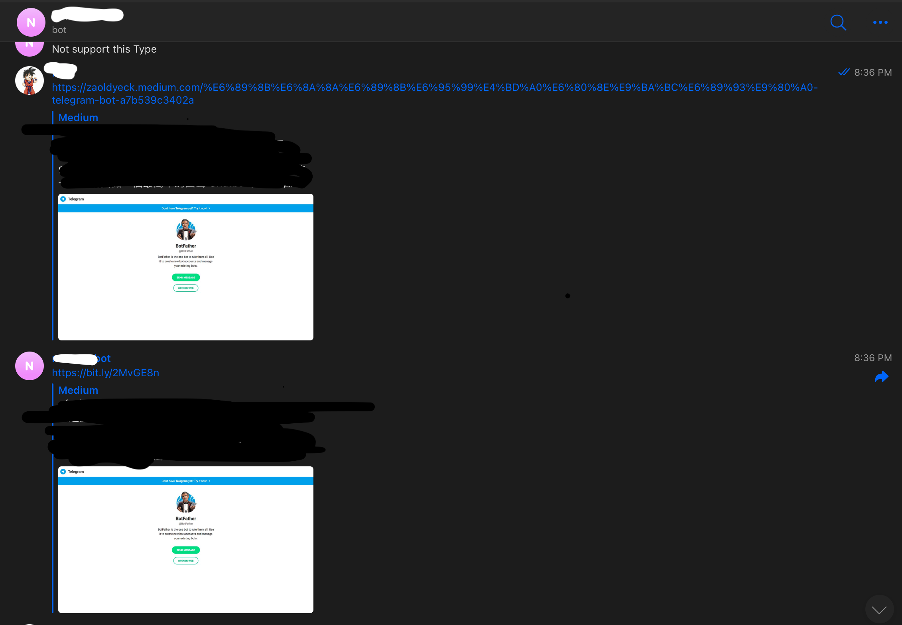

# TelegramBot via cdk deploy

## You need two token.
- [Get Telegarm Bot Token](https://core.telegram.org/bots)
  - like: 1234456789:xcvbnzxcvxcvbxcvbxcvbxcvbxbcvbcv
- [bitly access token](https://dev.bitly.com/docs/getting-started/authentication)
  - like: 2345678976543456789843456789754 

## Export Token to ENV VAR.
```bash
export TELEGRAM_TOKEN=1234456789:xcvbnzxcvxcvbxcvbxcvbxcvbxbcvbcv #Please replace to yours.
export URLTOKEN=234cc56e789f765s43f456f789f84f345s67 #Please replace to yours.
```

### To deploy
```bash
cdk deploy

 ✅  telegramBot

Outputs:
telegramBot.URL = https://xxxxxxxxxx.execute-api.us-east-1.amazonaws.com/
```

### To destroy
```bash
cdk destroy
```


### GetUpdate 
```bash
curl "https://api.telegram.org/bot${TELEGRAM_TOKEN}/getUpdates"
{
  "ok": true,
  "result": [
    {
      "update_id": 910754559,
      "message": {
        "message_id": 4,
        "from": {
          "id": 012345678,
          "is_bot": false,
          "first_name": "Firse Name",
          "username": "user_name",
          "language_code": "zh-hant"
        },
        "chat": {
          "id": 012345678,   # your can use this chat_id to send message to user.
          "first_name": "Firse Name",
          "username": "user_name",
          "type": "private"
        },
        "date": 1614338366,
        "text": "/start",
        "entities": [
          {
            "offset": 0,
            "length": 6,
            "type": "bot_command"
          }
        ]
      }
    },
    ...
  ]
}
```


### Send Message to specify chat
```bash
curl \
"https://api.telegram.org/bot${TELEGRAM_TOKEN}/sendMessage?chat_id=${chat_id}&text=hello"
---
{"ok":true,"result":{"message_id":38,"from":{"id":16000000025,"is_bot":true,"first_name":"....bot","username":"....bot"},"chat":{"id":012345678,"first_name":"First","username":"user_name","type":"private"},"date":1614417963,"text":"hello"}}(venv)
```

### Set webhook for Telegram Bot
```bash
curl \
"https://api.telegram.org/bot${TELEGRAM_TOKEN}/setWebhook?url=https://xxxxxxxxxx.execute-api.us-east-1.amazonaws.com/hook"
---
{"ok":true,"result":true,"description":"Webhook was set"}
```

### delete webhook for Telegram Bot
```bash
curl \
"https://api.telegram.org/bot${TELEGRAM_TOKEN}/deleteWebhook
---
{"ok":true,"result":true,"description":"Webhook was deleted"}
```


# Now Support 
#### url Shorter


#### echo message


#### check not support type
